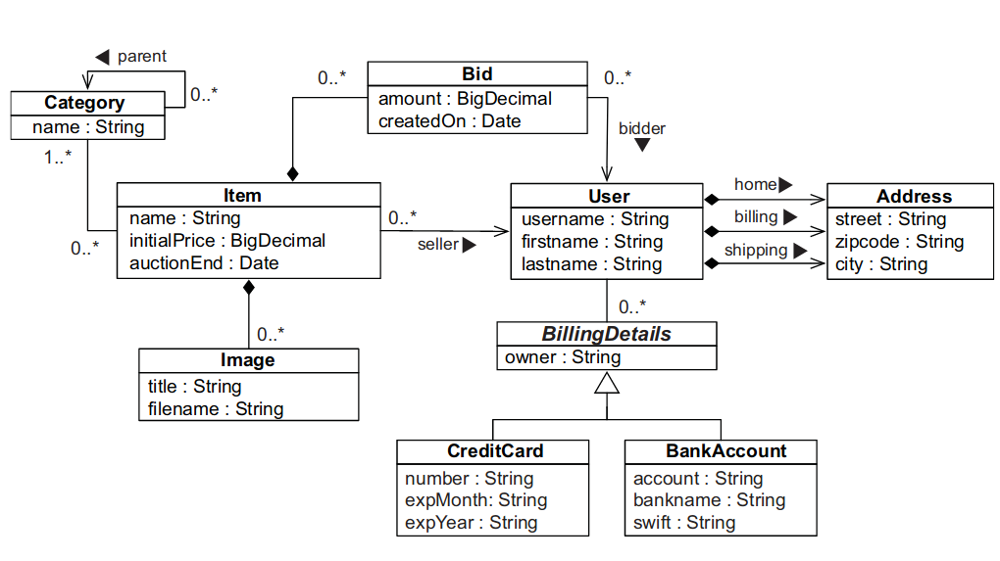

# CaveatEmptor Application

This project is an Implementation of the Java Persistence With Hibernate Book 2 edition.
the project uses the Domain Model - CaveatEmptor Domain Model with Spring Boot to create a Restful API that 
expose the Domain Model through an API.

the Domain Model is As Follow :
---

